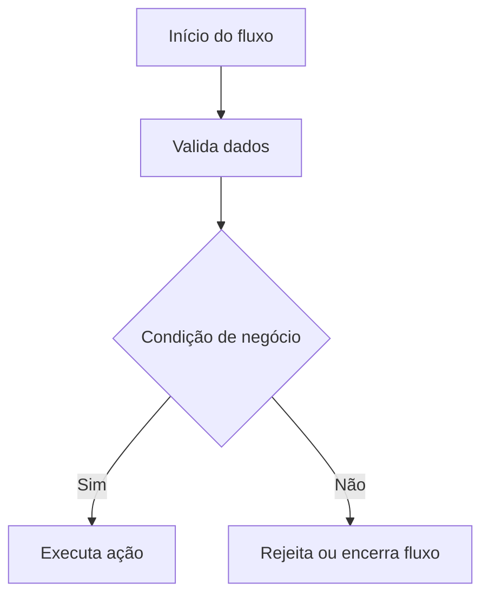

# Skill: document-business-flow

## Objetivo

Gerar uma visão de negócio de um fluxo existente no código, usando Mermaid `flowchart`.

## Quando Usar

Use esta skill quando o usuário pedir para explicar o comportamento de negócio de um fluxo técnico.

## Regras Obrigatórias

1. Use Mermaid `flowchart TD`.
2. Não invente regras de negócio.
3. Diferencie decisão de ação.
4. Quando uma regra não estiver explícita no código, marque como inferência ou ponto não identificado.
5. Use linguagem compreensível para pessoas técnicas e não técnicas.
6. Sempre liste evidências.
7. Não substitua o diagrama técnico; este diagrama complementa o técnico.

## Formato de Saída

```markdown
# Fluxo de Negócio: <nome-do-fluxo>

## Objetivo de Negócio

<explicação curta>

## Diagrama de Negócio



## Regras de Negócio Identificadas

| Regra | Evidência | Observação |
|---|---|---|

## Decisões do Fluxo

| Decisão | Critério | Evidência |
|---|---|---|

## Evidências Analisadas

- arquivo1
- arquivo2

## Pontos Não Identificados

- <ponto não claro>
```
