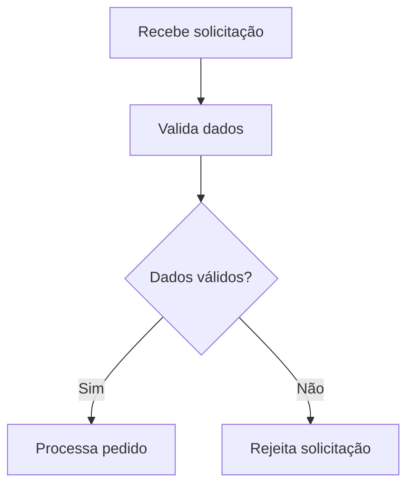

# Exemplo: Fluxo de Negócio

## Contexto

Exemplo mínimo de documentação de negócio com Mermaid `flowchart`.

## Saída esperada

```mermaid
flowchart TD
    A[Recebe solicitação] --> B[Valida dados]
    B --> C{Dados válidos?}
    C -->|Sim| D[Processa pedido]
    C -->|Não| E[Rejeita solicitação]
```
