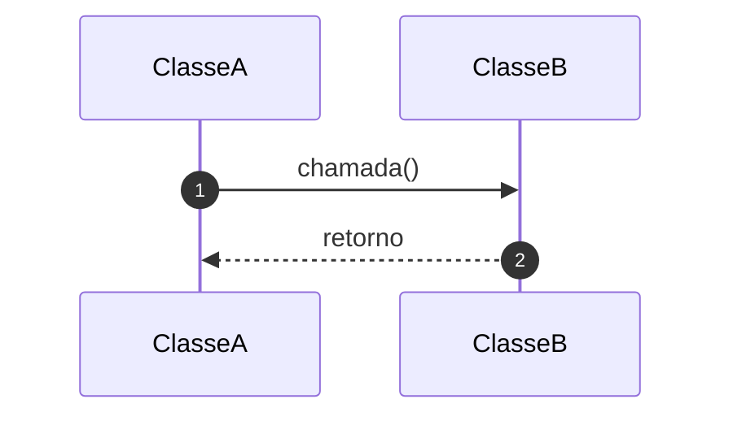

# Skill: document-sequence-flow

## Objetivo

Gerar documentação técnica de um fluxo legado usando Mermaid `sequenceDiagram`.

## Quando Usar

Use esta skill quando o usuário pedir para documentar um fluxo técnico.

## Regras Obrigatórias

1. Gere apenas `sequenceDiagram`.
2. Sempre use `autonumber`.
3. Use nomes reais de classes, métodos e integrações.
4. Não invente chamadas.
5. Não invente dependências externas.
6. Não invente tópicos, filas ou endpoints.
7. Diferencie chamadas síncronas de publicações assíncronas.
8. Liste evidências analisadas.
9. Declare pontos não identificados.
10. O Mermaid deve estar dentro de bloco Markdown `mermaid`.

## Formato de Saída

```markdown
# Fluxo Técnico: <nome-do-fluxo>

## Objetivo

<descrição curta>

## Diagrama de Sequência



## Descrição Técnica

## Participantes

| Participante | Tipo | Evidência |
|---|---|---|

## Dependências Internas

- <classe/método>

## Dependências Externas

- <serviço/tópico/fila/endpoint>

## Evidências Analisadas

- arquivo1
- arquivo2

## Pontos Não Identificados

- <dúvida ou limitação>

## Checklist de Revisão

- O Mermaid renderiza corretamente.
- Os participantes existem no código.
- As chamadas existem no código.
- As dependências externas foram confirmadas.
- Os tópicos/filas/endpoints foram confirmados.
```
