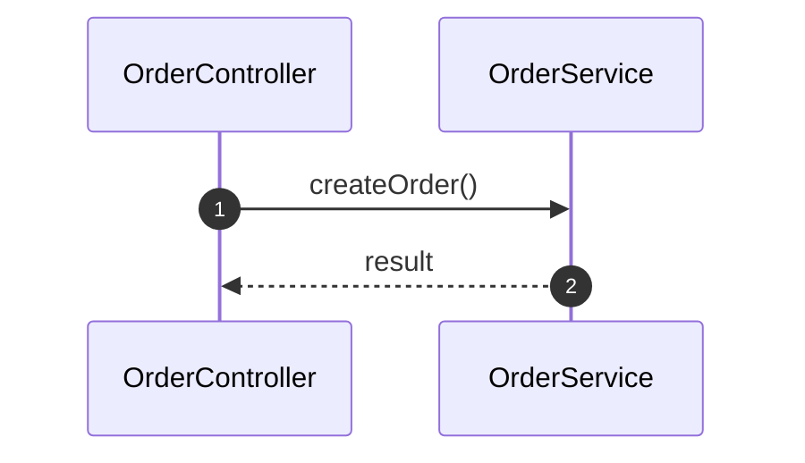

# Exemplo: Sequência de Fluxo

## Contexto

Exemplo mínimo de documentação técnica com Mermaid `sequenceDiagram`.

## Saída esperada

```mermaid
sequenceDiagram
    autonumber
    participant Controller as OrderController
    participant Service as OrderService
    Controller->>Service: createOrder()
    Service-->>Controller: result
```
